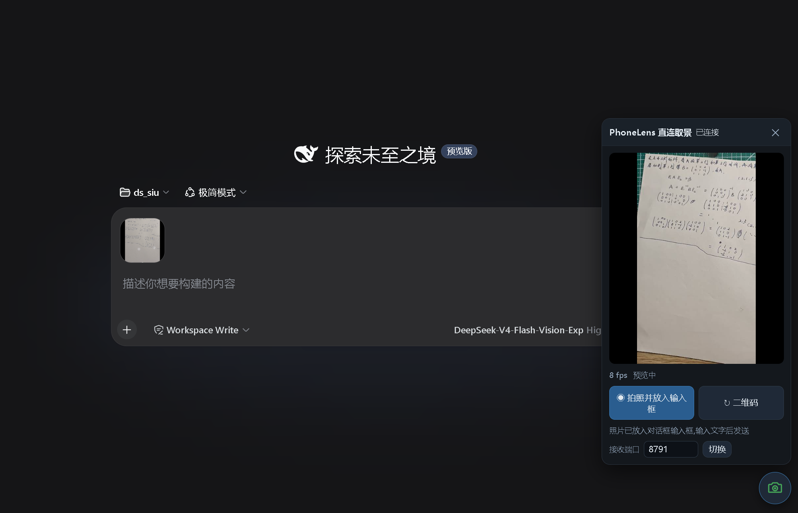
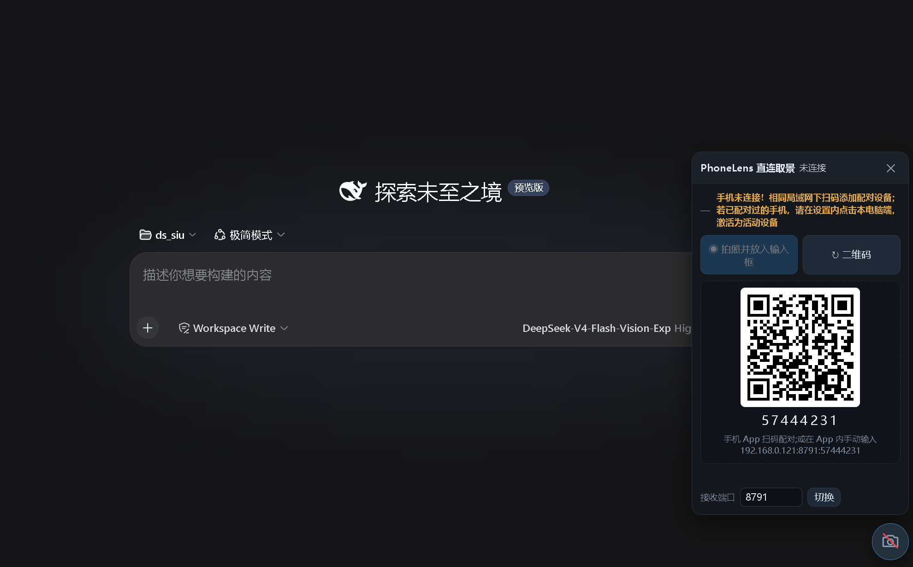
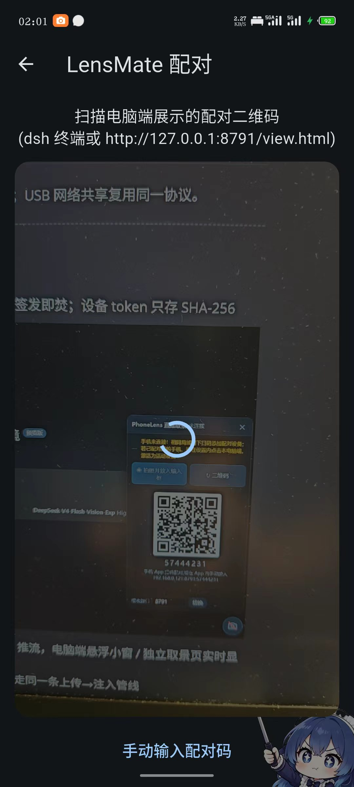
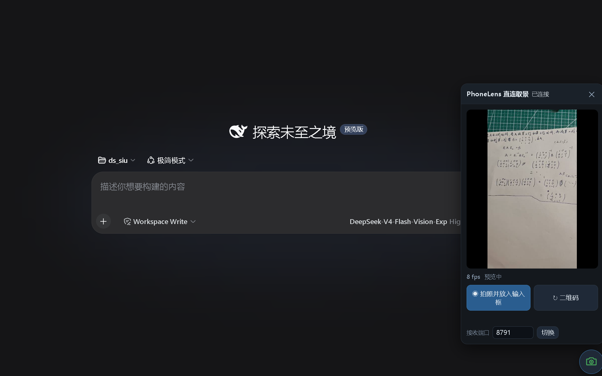
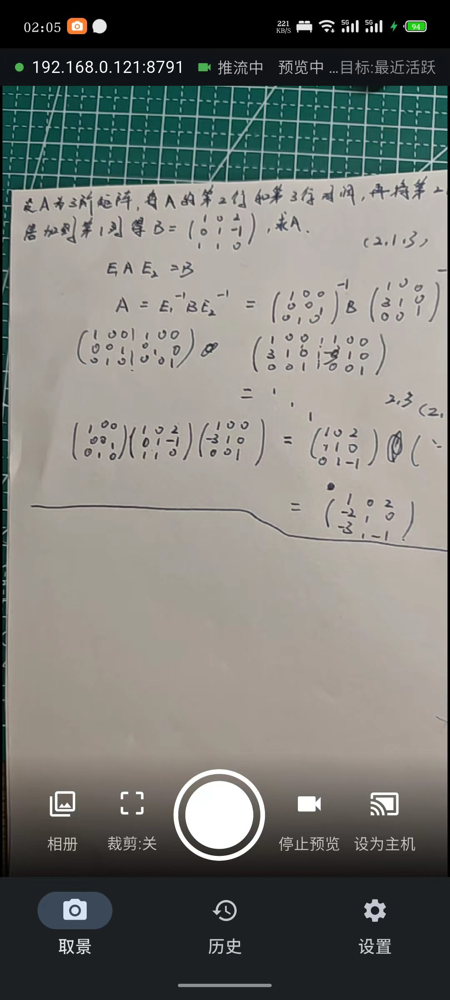
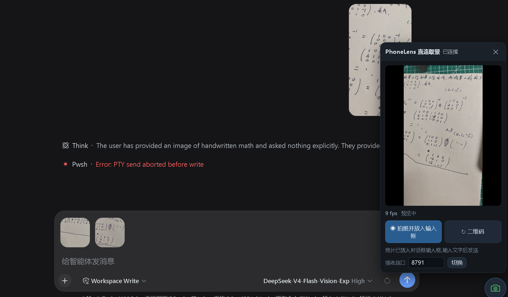
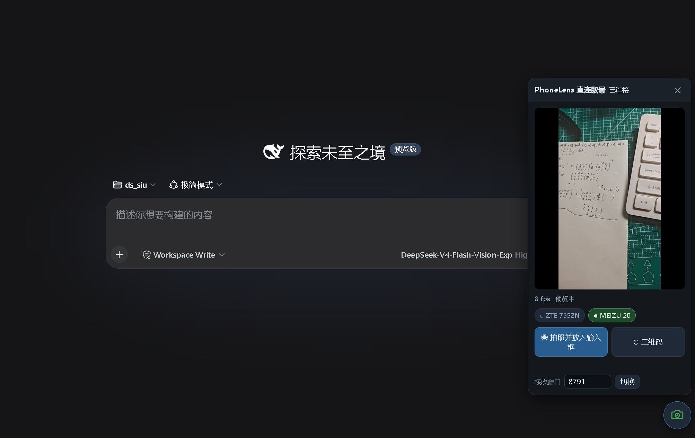
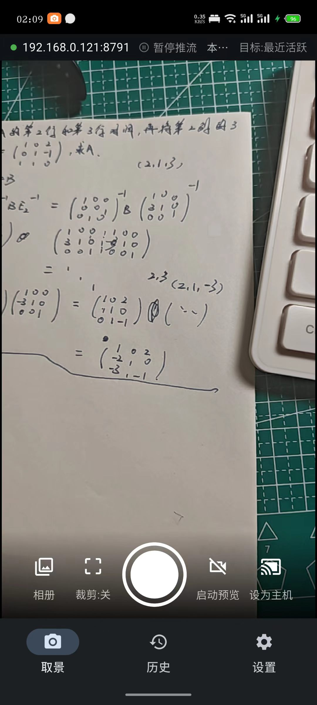
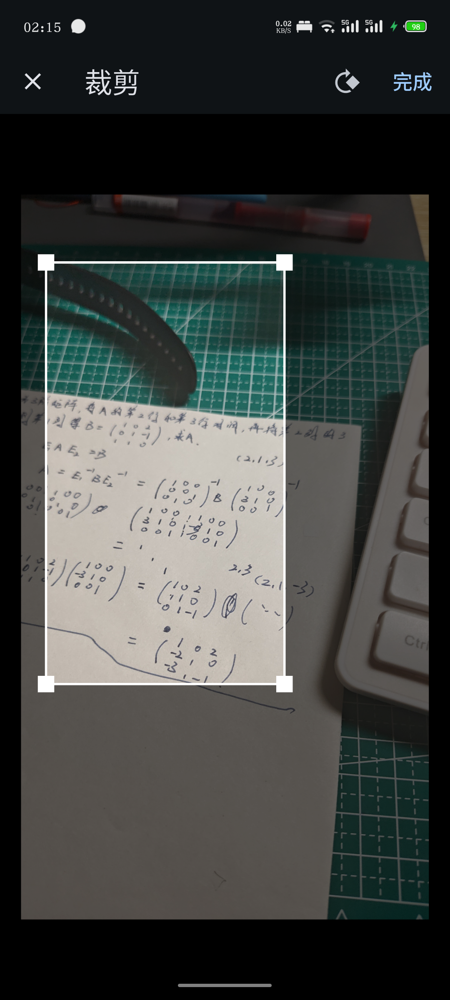

# PhoneLens —— 手机拍照直连DeepSeek Harness

> 手机拍照 / 实时取景，一键送达本机 **dsh** 会话，成为模型可直接消费的图片输入。



PhoneLens 由两部分组成，放在同一个仓库：

| 组件            | 路径                   | 说明                                                                                |
| ------------- | -------------------- | --------------------------------------------------------------------------------- |
| **主机插件（电脑端）** | `packages/lens-mate` | dsh **双面插件**：host 半边（接收服务，Node HTTP + WebSocket）+ client 半边（dsh Web UI 右下角悬浮取景小窗） |
| **手机 App**    | `packages/app`       | Flutter / Android：扫码配对、实时取景、拍照/裁剪/批量上传、设置                                         |

链路为局域网 HTTP/WebSocket，扫码一次性配对；USB 网络共享复用同一协议。

---

## ✨ 特性

- **扫码配对**：一次性 8 位配对码，15 分钟有效，签发即焚；设备 token 只存 SHA-256



- **实时取景**：手机以 MJPEG-over-WebSocket 推流，电脑端悬浮小窗 / 独立取景页实时显示





- **双端快门**：电脑端小窗或手机端任一快门，走同一条上传→注入管线

- **注入进会话**：图片自动写入 dsh 会话输入框，模型下一轮直接看到；可锁定目标会话（默认「最近活跃」）



- **多设备并存**：多台手机同时配对；电脑端切换预览、手机端「设为主机」一键抢占；未选中的手机暂停推流但仍可上传







- **自定义裁剪**：90° 旋转、裁剪框不出界、手柄可调、取消即丢弃；相册**批量连续裁剪**（逐张「下一张」→上传→下一张）



- **颜色校正**：预览红/蓝通道颠倒、肤色失真时一键校正
- **取景对焦**：点击对焦、长按锁定
- **发送历史**：三档（仅上传 / 图片留档 / 不留任何痕迹）
- **降级取景页**：`http://127.0.0.1:8791/view.html` 不依赖 dsh，支持系统画中画置顶小窗

---

## 🧭 新人快速安装（非开发者）

如果你是**第一次使用、不想折腾开发环境**，照下面两步即可，剩下交给手机扫码。

### 1. 手机端：下载并安装 App

1. 打开仓库右侧的 **Releases** 页（或直接访问 `https://github.com/yxqfg/phone-lens/releases`）
2. 下载最新版本里的 **`app-release.apk`**
3. 用手机打开该 APK 安装；首次会提示「允许安装未知来源应用」，允许即可
4. 安装后打开 **PhoneLens**

> 每次发布都会把打包好的 APK 附带在 Release 页，无需自己编译。

### 2. 电脑端：接入 dsh 插件

1. 先安装 DeepSeek Harness (dsh) 并初始化 web 配置
2. 下载仓库 **Source code (zip)** 并解压，或用 `git clone`
3. 管理员 PowerShell 运行：
   
   ```powershell
   powershell -ExecutionPolicy Bypass -File scripts\dev-install.ps1
   ```
4. 重启 `dsh web`，终端会打印配对二维码

### 3. 配对与使用

- 手机 App 扫电脑端二维码 → 配对成功
- 取景页按快门拍照（可选裁剪）→ 图片进入 dsh 会话；或点「启动预览」→ 电脑端悬浮小窗实时取景

> 需要构建/开发的进阶步骤见下面的「快速开始」。

## 🚀 快速开始

### 1. 电脑端：把插件装进 dsh web profile

```powershell
# 构建并安装（需要 pnpm；首次会初始化 profile）
powershell -ExecutionPolicy Bypass -File scripts\dev-install.ps1
```

> 已发布 npm 后可直接：`dsh plugin --profile web add phone-lens`；或用
> [Releases](https://github.com/yxqfg/phone-lens/releases) 附带的 tarball 安装。
> 完整使用说明见 [`docs/usage.md`](docs/usage.md)。

重启 `dsh web`，终端会打印配对二维码；也可以浏览器打开
`http://127.0.0.1:8791/view.html`（降级取景页：实时画面 + 二维码 + 快门 + 画中画置顶小窗）。

> 开发调试（不进 dsh，上传落盘到 `~/.dsh/phone-lens/uploads`）：
> `cd packages\lens-mate; pnpm build; pnpm dev:standalone`

### 2. 手机端：安装 App

```powershell
powershell -ExecutionPolicy Bypass -File scripts\adb-install.ps1 -Run
```

### 3. 配对

1. 电脑端展示二维码（dsh 终端 ASCII 码，或 /view.html 页面）
2. 手机 App 扫码；无法扫码时用「手动输入配对码」（`主机:端口:配对码`）
3. 配对码一次性，15 分钟有效；设备 token 只存哈希

### 4. 使用

- **拍照模式**：取景页按快门 →（可选裁剪）→ 发送 → 图片进入当前会话，模型下一轮直接看到
- **实时取景**：取景页点「启动预览」→ 电脑端预览显示实时画面；双端任一快门都走同一条入库管线
- **多设备**：手机端「设为主机」一键把电脑端预览切换到本机；电脑端小窗也可切换、双击设备名重命名
- 目标会话默认「最近活跃」；可在设置页固定

### 电脑端预览的两种入口

| 入口               | 位置                                | 说明                                                              |
| ---------------- | --------------------------------- | --------------------------------------------------------------- |
| **Web UI 内嵌（主）** | dsh Web UI 页面**右下角 📷 按钮**        | 悬浮取景窗：实时画面、快门、配对二维码（相机未连时）、注入回执；需先跑一次 `dev-install.ps1` 并重启 dsh |
| **独立取景页（降级）**    | `http://127.0.0.1:8791/view.html` | 不依赖 dsh；支持画中画置顶小窗；也可作协议冒烟                                       |

> 「已保存到电脑 ✓（暂未注入会话）」不是错误：图片已落盘，只是当前没有进行中的 dsh 会话（或尚未接入 dsh）。

### 防火墙（首次）

```powershell
# 管理员运行，放行 8791（私有网段）
powershell -ExecutionPolicy Bypass -File scripts\firewall.ps1
```

### 无手机验证电脑端

```powershell
cd packages\lens-mate; $env:LENS_DATA_DIR="$PWD\.smoke-data"; node lib\dev.js   # 终端 A
node scripts\smoke\smoke.mjs 8791                                              # 终端 B
```

---

## 📁 目录结构

```
.
├── README.md
├── LICENSE                      # MIT
├── docs/
│   ├── architecture.md          # 架构方案：决策、目录结构、数据流、阶段计划
│   ├── protocol.md              # 传输协议：配对/上传/取景（HTTP + WS）
│   ├── dsh-caps.md              # DSH 能力缝调研：附件注入 / Slot UI / agent 事件
│   └── usage.md                 # 使用说明：日常操作与常见问题
├── packages/
│   ├── lens-mate/               # dsh 双面插件（电脑端主体，包名 phone-lens）
│   │   ├── src/                 #   ── host 半边（Node）──
│   │   │   ├── index.ts         #   装配：server + inject + tools + events
│   │   │   ├── server/          #   http 路由 / 鉴权 / ws hub / 静态取景页
│   │   │   ├── inject/          #   附件保存 + 目标会话 + 消息形态
│   │   │   └── store/           #   配对 / 设备注册表（token 哈希）
│   │   ├── lib/client.js        #   ── browser 半边：Web UI 悬浮取景小窗 ──
│   │   ├── cordis.patch.yml     #   向 profile insert 本插件 host 行
│   │   └── package.json         #   dsh.bundle.patch + dsh.client 声明
│   └── app/                     # Flutter 手机端
│       ├── lib/core/            #   HTTP 客户端 / WS uplink / JPEG 编码 / 配对存储
│       ├── lib/features/        #   配对、取景、裁剪、历史、设置、关于
│       ├── android/             #   权限 & 构建
│       └── pubspec.yaml
└── scripts/
    ├── dev-install.ps1          # 把插件装进 dsh web profile
    ├── firewall.ps1             # 放行 8791（仅私有网段）
    ├── adb-install.ps1          # flutter build apk + adb install
    └── smoke/                   # 协议冒烟测试
```

> 注：插件包名统一为 **`phone-lens`**；目录名沿用 `packages/lens-mate`（文件系统路径），应用显示名为 **PhoneLens**。

---

## 🛠️ 开发

```bash
# 主机插件
cd packages/lens-mate
pnpm install
pnpm build            # tsdown 构建 lib/index.js + lib/dev.js

# 手机 App（需 Flutter SDK）
cd packages/app
flutter pub get
flutter run            # 或 flutter build apk --release
```

**运行插件冒烟**（无真实手机）：

```powershell
cd packages\lens-mate; $env:LENS_DATA_DIR="$PWD\.smoke-data"; node lib\dev.js
node scripts\smoke\smoke.mjs 8791
```

## 🛡️ 安全要点

- 回环（127.0.0.1）免鉴权；非回环必须设备 token（配对签发，只存 SHA-256）
- 配对码一次性 + TTL，签发即焚；`/ws/view`、`/view.html`、`/qr*` 仅回环
- 上传白名单 JPEG/PNG，双验 Content-Type + magic bytes，≤10MB（可配），限流
- 安全问题的披露方式见 [SECURITY.md](SECURITY.md)

## 📄 许可

本项目以 [MIT](LICENSE) 许可发布。参与开发请阅读 [CONTRIBUTING.md](CONTRIBUTING.md) 与 [CODE_OF_CONDUCT.md](CODE_OF_CONDUCT.md)。

## 🏷️ 版本

当前 `v0.2.0`（主机插件），详见 [CHANGELOG.md](CHANGELOG.md)。
