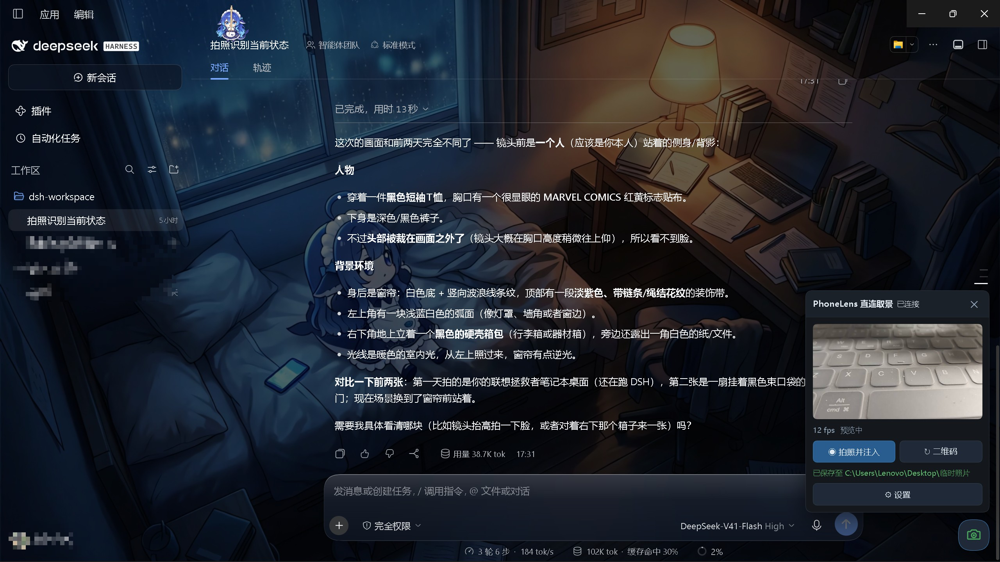
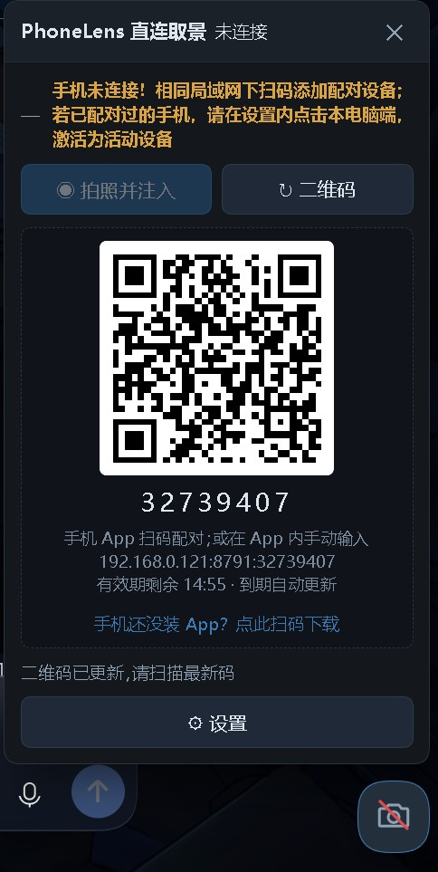
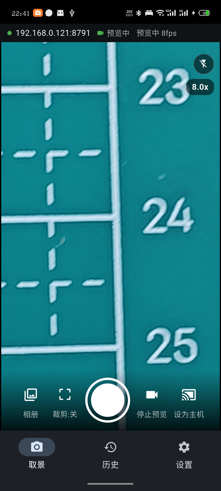
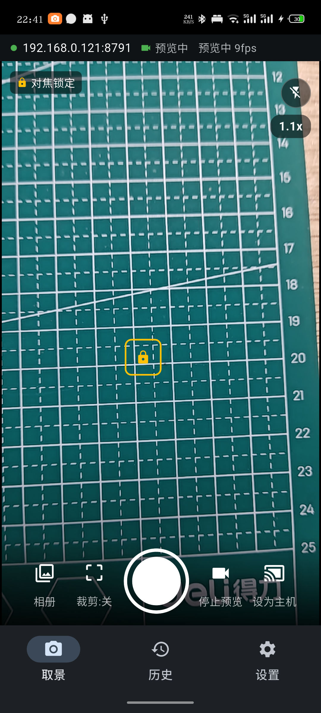
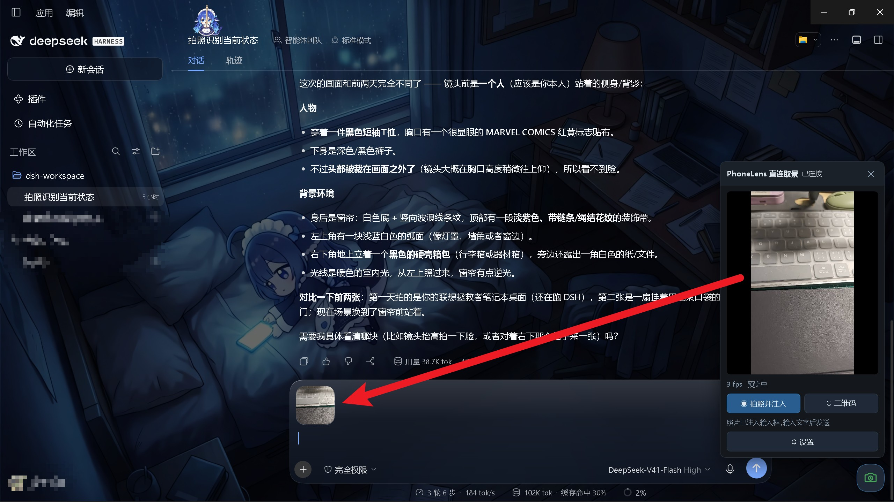
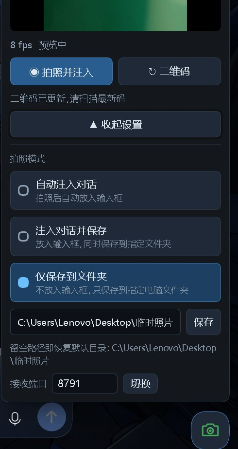
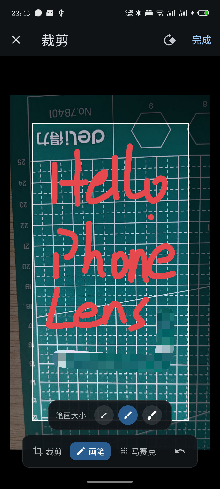
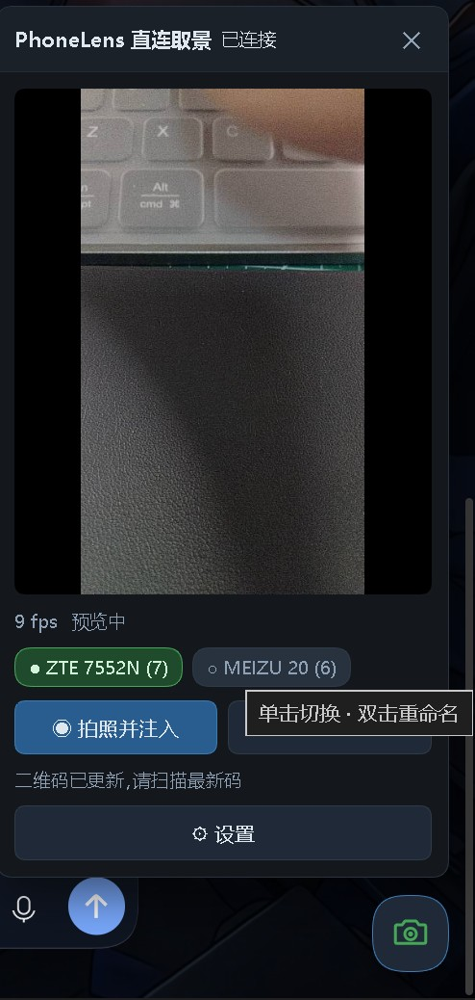
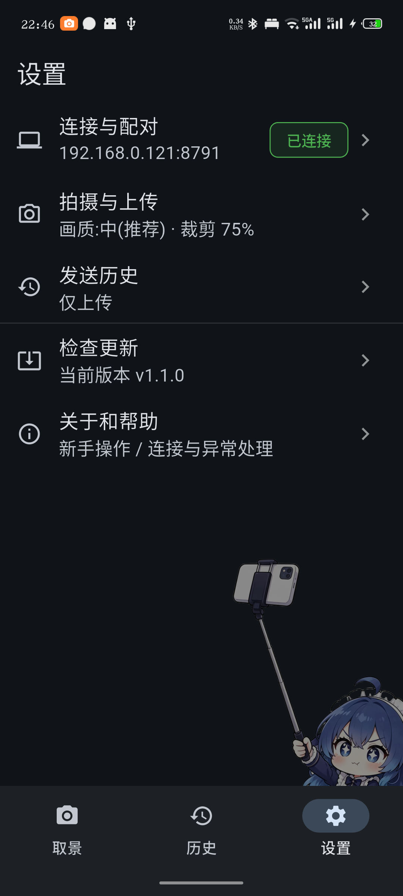
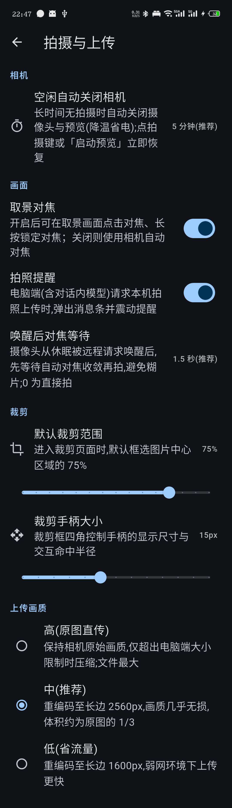

# PhoneLens —— 手机拍照直连 DeepSeek Harness

> 手机拍照 / 实时取景，一键送达本机 **dsh** 会话，成为模型可直接消费的图片输入；模型也能反过来调用手机相机（默认逐次审批）。



- **主机插件**（`packages/phone-lens`）：dsh 双面插件——host 半边是 Node HTTP + WebSocket 接收服务，client 半边在 Web UI 右下角挂悬浮取景小窗
- **手机 App**（`packages/app`）：Flutter / Android，扫码配对、实时取景、拍照上传

链路为局域网 HTTP/WebSocket，扫码一次性配对；USB 网络共享复用同一协议。支持 dsh Web 与 dsh 0.2.0 桌面端。

---

## ✨ 特性

- **扫码配对**：一次性 8 位配对码，15 分钟有效，临期自动刷新；设备 token 只存 SHA-256



- **实时取景**：手机以 MJPEG over WebSocket 推流，电脑端悬浮小窗 / 独立取景页实时显示
- **取景控制**：捏合缩放、闪光灯三态、点击对焦、长按锁定





- **双端快门**：任一端按快门，同一条上传 → 注入管线
- **注入会话**：照片自动写入 dsh 会话输入框，模型下一轮直接看到；目标会话可锁定（默认「最近活跃」）



- **模型相机工具**：模型可调用 `phone_take_photo` / `phone_camera_pause` / `phone_camera_resume`——对它说「用手机拍一下现在的屏幕」即可；默认逐次审批，免确认须显式开启，远程拍照时手机震动提醒
- **投递模式**：注入对话 / 保存到指定文件夹 / 两者



- **上传队列**：断网不丢片，恢复后自动续传，可取消 / 重试
- **上传画质三档**：高 / 中 / 低
- **照片加工**：裁剪、90° 旋转、画笔标注、马赛克



- **相册批量连续裁剪**：多选后逐张「下一张」→ 上传
- **多设备并存**：多台手机同时配对，电脑端切换预览，手机端「设为主机」一键抢占



- **心跳保活**：双端互唤醒心跳，自动识别半开连接并重连
- **空闲自动关相机**：默认 5 分钟，可调 1 / 5 / 30 / 永不
- **发送历史三档**（仅上传 / 留档 / 不留痕迹）+ 可选自动清理
- **App 内检查更新**（Gitee / GitHub 双源），有新版时设置页亮角标





- **降级取景页**：`http://127.0.0.1:8791/view.html` 不依赖 dsh，支持画中画置顶小窗

---

## 🧭 新人快速安装（非开发者）

### 1. 手机端

1. 打开 [Releases](https://github.com/yxqfg/phone-lens/releases)（国内可走 [Gitee 镜像](https://gitee.com/qianfengbingtang/phone-lens/releases)）
2. 下载最新版 `app-release.apk` 并安装（arm64-v8a）
3. 打开 PhoneLens

### 2. 电脑端

```powershell
dsh plugin --profile web add phone-lens
```

重启 `dsh web` 即可。也可以用预构建 tarball：

```powershell
dsh plugin --profile web add https://github.com/yxqfg/phone-lens/releases/latest/download/phone-lens.tgz
```

或从源码（管理员 PowerShell）：

```powershell
powershell -ExecutionPolicy Bypass -File scripts\dev-install.ps1
```

### 3. 配对

手机扫电脑端二维码（dsh 终端 ASCII 码，或 Web UI 小窗）→ 配对成功 → 取景页拍照或「启动预览」。

> 手机没装 App？电脑端小窗「点此扫码下载」直接扫码下载 APK。

## 🚀 快速开始（开发）

```powershell
# 主机插件：构建并装进 dsh web profile（需要 pnpm）
powershell -ExecutionPolicy Bypass -File scripts\dev-install.ps1

# 手机 App（需 Flutter SDK）
powershell -ExecutionPolicy Bypass -File scripts\adb-install.ps1 -Run
```

重启 `dsh web` 后终端打印配对二维码。

```powershell
# 防火墙（首次，管理员）：放行 8791（仅私有网段）
powershell -ExecutionPolicy Bypass -File scripts\firewall.ps1

# 无手机冒烟验证电脑端
cd packages\phone-lens; $env:LENS_DATA_DIR="$PWD\.smoke-data"; node lib\dev.js   # 终端 A
node scripts\smoke\smoke.mjs 8791                                              # 终端 B
```

完整使用说明见 [`docs/usage.md`](docs/usage.md)。

## 📁 目录结构

```
.
├── README.md
├── LICENSE                      # MIT
├── docs/
│   ├── architecture.md          # 架构方案：决策、目录结构、数据流、阶段计划
│   ├── protocol.md              # 传输协议：配对/上传/取景（HTTP + WS）
│   ├── dsh-caps.md              # DSH 能力缝调研：附件注入 / Slot UI / agent 事件
│   └── usage.md                 # 使用说明：日常操作与常见问题
├── packages/
│   ├── phone-lens/               # dsh 双面插件（电脑端主体，包名 phone-lens）
│   │   ├── src/                 #   host 半边（Node）：server / inject / store
│   │   ├── lib/client.js        #   browser 半边：Web UI 悬浮取景小窗
│   │   └── package.json         #   dsh.bundle.patch + dsh.client 声明
│   └── app/                     # Flutter 手机端
│       ├── lib/core/            #   HTTP 客户端 / WS uplink / 上传队列 / 检查更新
│       └── lib/features/        #   配对、取景、裁剪、上传队列、历史、设置、关于
└── scripts/
    ├── dev-install.ps1          # 把插件装进 dsh web profile
    ├── firewall.ps1             # 放行 8791（仅私有网段）
    ├── adb-install.ps1          # flutter build apk + adb install
    └── smoke/                   # 协议冒烟测试
```

> 注：插件包名与目录名统一为 **`phone-lens`**，应用显示名为 **PhoneLens**。

## 🛠️ 开发

```bash
# 主机插件
cd packages/phone-lens
pnpm install
pnpm build            # tsdown 构建 lib/index.js + lib/dev.js

# 手机 App
cd packages/app
flutter pub get
flutter run           # 或 flutter build apk --release
```

## 🛡️ 安全要点

- 回环（127.0.0.1）免鉴权；非回环必须设备 token（配对签发，只存 SHA-256）
- 配对码一次性 + TTL，签发即焚；`/ws/view`、`/view.html`、`/qr*` 仅回环
- 上传白名单 JPEG/PNG，双验 Content-Type + magic bytes，≤10MB（可配）
- 模型相机工具默认逐次审批；安全披露方式见 [SECURITY.md](SECURITY.md)

## 📄 许可

[MIT](LICENSE)。参与开发请阅读 [CONTRIBUTING.md](CONTRIBUTING.md) 与 [CODE_OF_CONDUCT.md](CODE_OF_CONDUCT.md)。

## 🏷️ 版本

当前 `v1.1.0`，详见 [CHANGELOG.md](CHANGELOG.md)。
